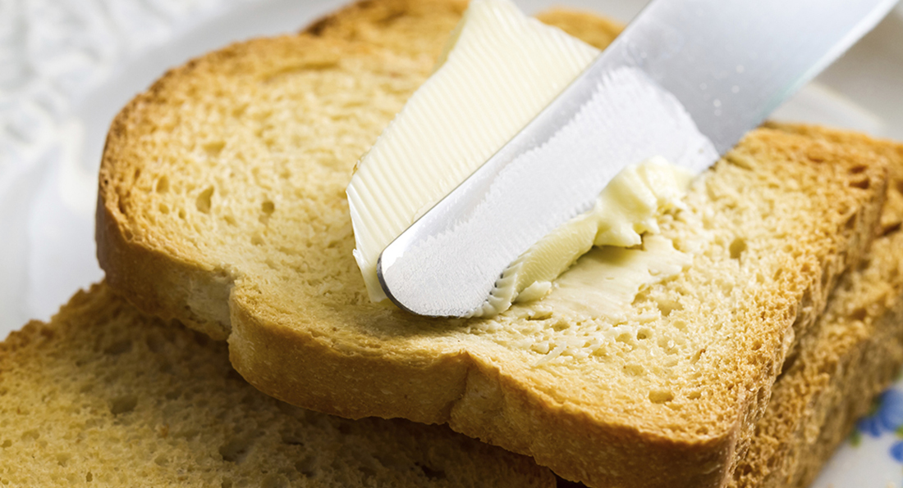

## My Breakfast Problem

The Merriam-Webster website defines a question as “an interrogative expression often used to test knowledge.” Questions serve an important role in all aspects of life as a means of improvement. To learn you have to ask questions, to be an expert you have to answer questions. It is this routine cycle of asking and answering that impair our ability to ask the correct questions. I believe, that by asking smart you will gain more knowledge than what the question originally asked. Thus, that leaves just one question: How do you ask a smart question?

## How To Make Bread and Butter

## The Bread and Butter
