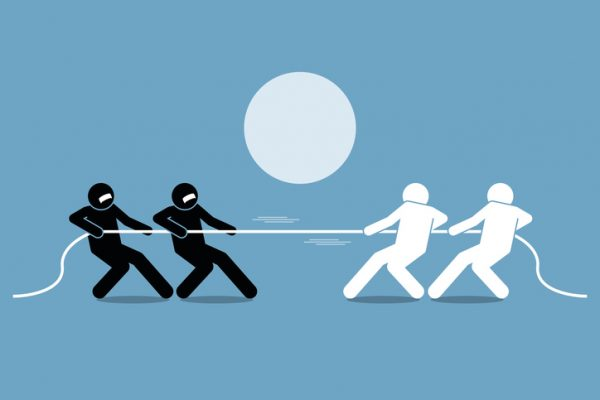

## Making a Promise

On new year's day of 2017, I made a promise to gain 20 pounds by going to the gym. Eleven months later, I'm still at my starting weight. "But my schoolwork and part time job prevented me from going to the gym! Does that still make me a bad person?" Yes, from an ethical standpoint I am untrustworthy as I do not keep my promises.

## "Why Can't Everything Be Black and White?"

Ethics serves a a book of guidance in this complicated world of ours. In movies, comic books, and video games, it can be easy to see who is good and who is bad. In reality, the world is a mix of bad and good, white and black, day and night. It is important to have the ability and courage to navigate these complex situations that arise from time to time. As such, software engineering ethics act as a book of guidelines for the professional to reference when an ethical dilemma appears and an oath to uphold key values.

## A Conundrum

Software engineers are presented with a new set of ethical obligations, namely the distribution of information. When Google released its StreetView feature, many people were upset as they believed their privacy was violated. This is a dilemma as it is not illegal to take pictures, but distributing them to others without a person's consent can lead to many issues. For example, a criminal could use Google StreetView to gather information on the residents in a location to burglarize. With this new information, a criminal could target places where there was poor lighting or homes with elderly people as they offer less resistance. These are the types of problems that a software engineer must identify, research, and come to a conclusion.

## A Solution
Google's software engineers should have considered the ACM Code, which states "respect the privacy of others." An overabundance of information was gathered as StreetView does not require pictures of people to serve its purpose. Thus, software engineers should have processed the pictures, censoring people, before publishing them to the internet. It is important to always keep in mind the health, safety, and well-being of the public. As an upcoming engineer, I still need to improve my professional diligence. I want to be able to uphold the oath of the internet, "to share information safely and securely."
