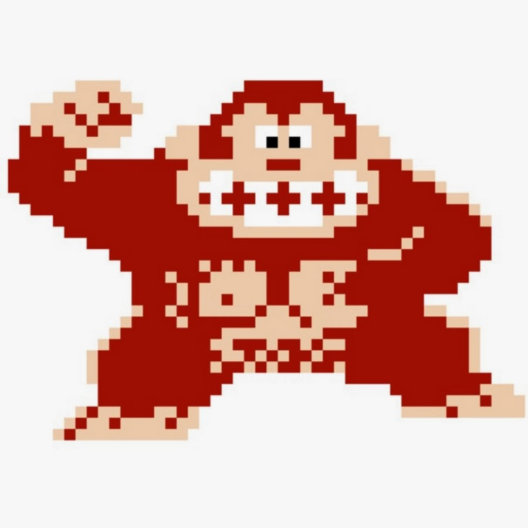

## Gameboy beginnings

My first personal connection with computer hardware and software came in the form of a yellow Gameboy Color. It was small enough to fit into my pocket, but had a screen large enough for my eyes to distinguish Donkey Kong from the Kremlings. Additionally, the Color had backwards compatibility, allowing me to play Pokemon Red and beat the Elite Four. I did not realize that all of my favorite games were just 1s and 0s being passed from the cartridge to the console hardware; that is why I decided to learn about software engineering.

## Presentation of data 

Whether you are creating a website, managing a database, or making a video game, presentation is key. Learning about software engineering and how to present data has been captivating as it is virtually hidden. If a developer has done their job then a person will have everything they need at the front-end and will not have to worry about what is happening at the back-end. In addition, the amount of ways you can present a piece of data truly speaks about a developer’s experience. For instance, instead of a 0 you can display “Zero”, or you can show Donkey Kong. I want to master the skills needed to be able to present data minimally, efficiently and in different forms to solve issue at hand. 

## The Future

I am just starting my Software Engineering class and am eager to learn about what this profession entails. I know I will gain many things related to software but I want to experience being a developer; being given a task and having the freedom to choose how to approach and solve the problem professionally. There will be tough times along the way but eventually I will be able to make my own version of Donkey Kong.
