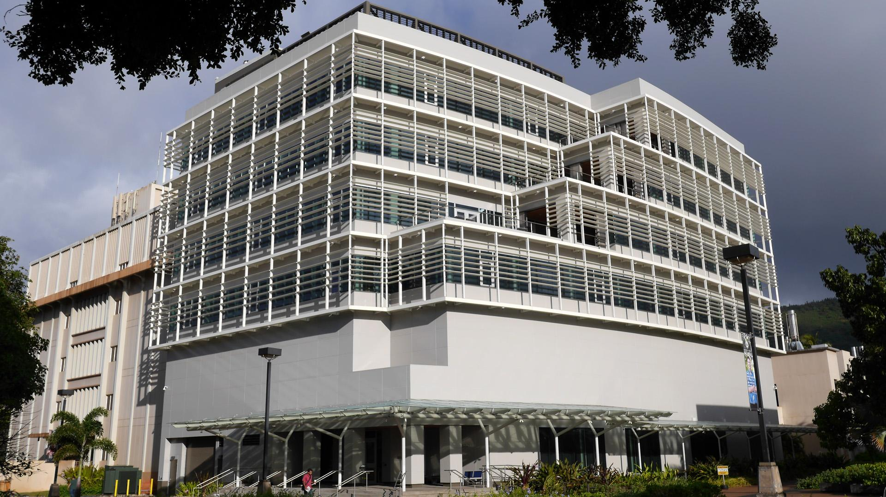

  
  

The University of Hawaii at Manoa started construction on the Information Technology (IT) Center on February 2, 2012. This 74,000 square foot building would be the new location for IT personnel and equipment. Inside this building is an 8,000 square foot datacenter which houses the necessary servers, routers, and switches necessary for the University of Hawaii System to function across its 10 campuses. With this in mind, it was a challenge to schedule, move, and install the equipment into the new datacenter.

For this project, I was assigned to a team responsible for the uninstallation, transportation, and re-installation of equipment from the old datacenter to the new one. I started by preparing both sites with the necessary tools and hardware to uninstall and reinstall equipment for the day. The next step was to acquire and prepare the carts and vehicles necessary to move equipment from the two locations. Many servers were using disk drives which required extra care in transportation with the use of moving blankets and other material. Finally, the last step was to reinstall the equipment into the new cabinet and verify with customers that systems and services were working. By the end of the year, we were able to move all IT equipment into the new datacenter without missing any deadlines.

In short, this project provided great experience in datacenter equipment installation, planning, and effective communication.

