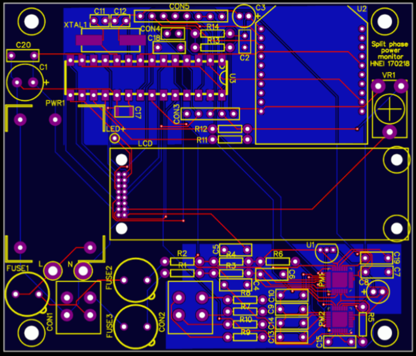

I was part of a team with the Hawaii Natural Energy Institute (HNEI) to develop a power monitoring device for utility measurements. This device would eventually be installed onto utility poles to take power measurements and collect data. My group was given the task of developing communications between the PIC microcontroller and power monitoring chip. Programming was performed with the MPLAB IDE and Pickit to upload the code to the microcontroller.

Our communication of choice was I2C as it allowed multiple slave devices to speak to the microcontroller using a shared bus, saving pins and allowing future expansion. I started programming by enabling the basic registers needed for I2C. Next, I programmed the I2C protocol which consisted of a start sequence, address, data, and stop sequence. After much debugging, we were able to pull data from the power monitoring chip and display the results.

Overall, in this project I gained experience with the MPLAB IDE, debugging, and a greater understanding of embedded system design.
