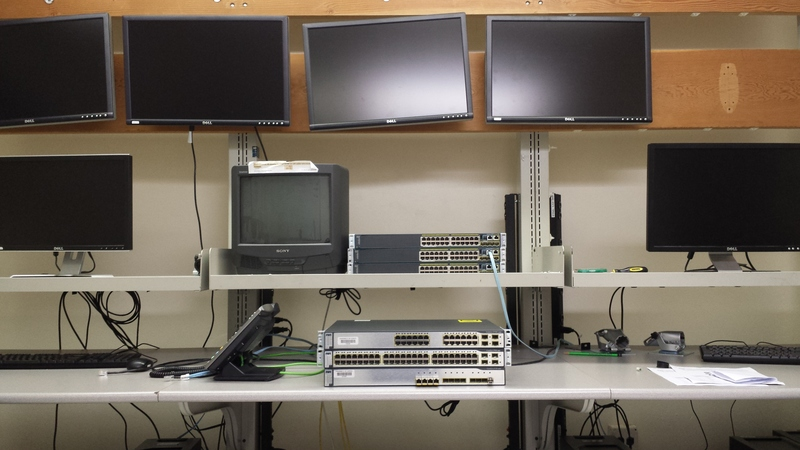

At my student job as a Datacenter Technician, it is important to understand the concepts of routing and switching in order to perform daily routines. Installing equipment, editing configurations, and troubleshooting all require a solid understanding of routing and switching. For this purpose, I was given the task of assembling a lab in order to train myself and coworkers by practicing Cisco Certified Networking Associate (CCNA) labs.

For this project, I started by acquiring the equipment necessary to perform the labs. The Catalyst 3750 and Catalyst 2960 series switches were chosen as they are the devices installed in the University network for routing and switching. Next, I prepared the switches by wiping the configurations and updating the IOS software image. Finally, I installed the devices into the lab location and verified that the switches and routers were working without issue.

This project provided experience in designing a test environment to simulate an actual network setup. In addition, completing the labs increased my knowledge of routing and switching protocols including EIGRP, OSPF, STP, RSTP, and FTP. As a result, I was better equipped to accomplish my duties as a technician.
